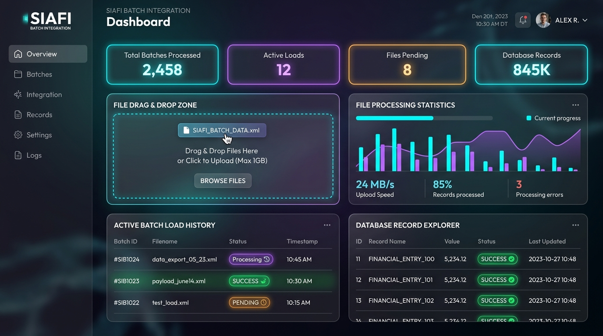

# File Processor Batch - Spring Batch Projects

Este repositório contém projetos focados em processamento de arquivos em lote (Batch Processing) e conformidade arquitetural.

---

## 🚀 Projeto em Destaque: SIAFI Batch File Integration

O **SIAFI Batch File Integration** é um sistema completo e de alta performance baseado em **Spring Boot 3.x** e **Spring Batch 5.x** desenvolvido para automatizar e monitorar a importação de arquivos de carga nos layouts transacionais oficiais do Tesouro Nacional:
*   **Documento Hábil (DH001)**: Ingestão de Notas de Lançamento (NL) e compromissos.
*   **Programação Financeira (PF001)**: Ingestão de solicitações de saques e transferências de recursos.

O sistema suporta tanto os arquivos **XML oficiais** com namespaces complexos do governo quanto arquivos estruturados em **CSV**.

### 🎨 Painel de Controle Web (Glassmorphism UI)
A aplicação conta com um painel de controle web integrado acessível localmente:



### 🏗️ Arquitetura e Decisões de Design (Clean & Hexagonal)
*   **Isolamento Estrito de DTOs (Java Records)**: A camada de apresentação (REST Controllers) interage unicamente com registros imutáveis (Records) para evitar o vazamento de entidades JPA de persistência.
*   **Watch Folder (Folder-based Auto-consumption)**: Serviço integrado monitora uma pasta do sistema de arquivos (`incoming/`) a cada 10 segundos, disparando os jobs correspondentes de forma 100% autônoma.
*   **Chunk-Oriented Processing**: Processamento em fatias (commits periódicos de 5 em 5 registros) para garantir consistência financeira, baixo consumo de memória e rollbacks isolados em caso de falha.
*   **Central de Notificações**: Barramento reativo no topo do cabeçalho que reporta em tempo real no dashboard quando novos arquivos são processados na watch folder.

---

## 🛠️ Como Executar o SIAFI Batch Processor

1.  Entre na pasta do projeto:
    ```bash
    cd siafi-batch-processor
    ```
2.  Compile o código:
    ```bash
    ./mvnw clean compile
    ```
3.  Execute a aplicação Spring Boot:
    ```bash
    ./mvnw spring-boot:run
    ```
4.  Abra o painel no navegador:
    👉 **`http://localhost:8080/`** (Use as credenciais pré-preenchidas para logar).

---

## 📂 Outros Projetos no Repositório

*   **[`wow-auctions/`](file:///home/joelmaykon/file-processor-batch/wow-auctions/)**: Microsserviço Quarkus de processamento de leilões do WoW. Foi corrigido para eliminar dependências cíclicas entre mapeadores e modelos da API, além de mover testes unitários da pasta de domínio para assegurar conformidade com as regras de Balanced Architecture Governance.
*   **[`gs-batch-processing/`](file:///home/joelmaykon/file-processor-batch/gs-batch-processing/)**: Projeto de referência do guia oficial do Spring Batch.
