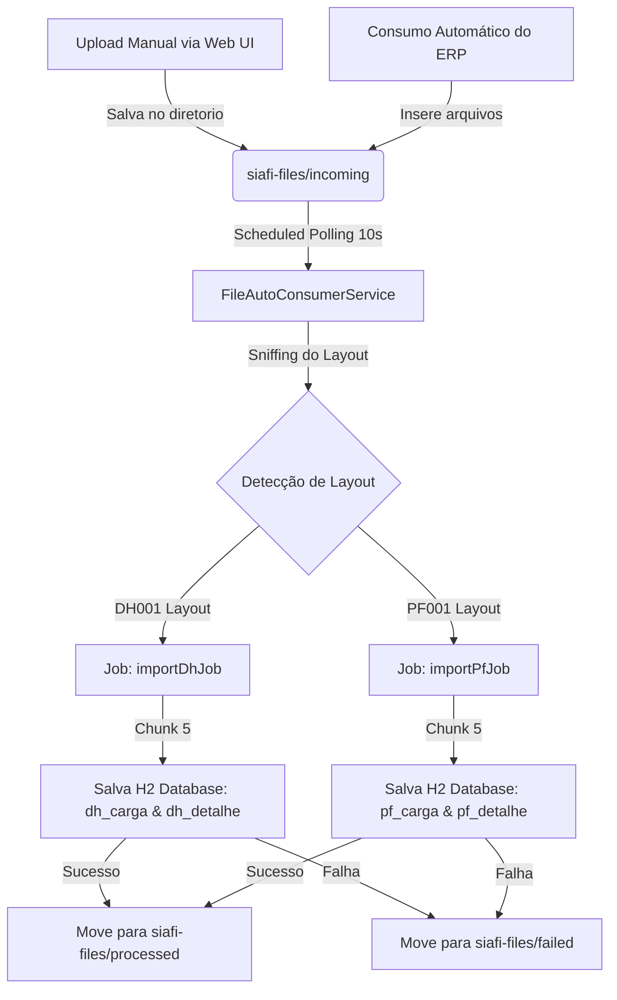

# Documentação de Arquitetura e Decisões Técnicas

Este documento descreve o funcionamento e o propósito de cada decisão técnica tomada na concepção e viabilidade do sistema **SIAFI Batch File Integration**. O sistema foi construído com base em padrões corporativos robustos utilizando **Spring Boot 3.x** e **Spring Batch 5.x**.

---

## 1. Visão Geral da Arquitetura do Sistema

O sistema resolve o desafio de integrar arquivos batch transacionais do SIAFI (layouts `DH001` - Documento Hábil e `PF001` - Programação Financeira) suportando tanto arquivos no formato **XML nativo** quanto planilhas **CSV**.

---

## 2. Detalhamento das Decisões Técnicas e Viabilidade

### A. Persistência de Execuções e Controle de Status (`JobRepository`)
> [!IMPORTANT]
> Em sistemas financeiros como o SIAFI, a rastreabilidade e a capacidade de reinicialização (*restartability*) são fundamentais.
* **O que foi feito:** O Spring Batch utiliza nativamente tabelas como `BATCH_JOB_EXECUTION` e `BATCH_JOB_INSTANCE` persistidas no banco de dados H2.
* **Propósito:** Se o processamento de um lote com milhares de linhas falhar no meio, o sistema pode recomeçar exatamente do ponto onde falhou.

### B. Processamento Baseado em Chunks (Chunk-Oriented Processing)
* **O que foi feito:** O processamento nos steps (`dhStep` e `pfStep`) foi configurado com `chunk(5)`.
* **Propósito:** Em vez de carregar todas as linhas do arquivo na memória e tentar salvar em uma transação única, o sistema lê e processa os itens em blocos (chunks).

### C. Estrutura Master-Detail para Documentos
* **O que foi feito:** Modelamos entidades relacionais separadas para Cabeçalho (`DhCarga` / `PfCarga`) e Detalhes (`DhDetalhe` / `PfDetalhe`).
* **Propósito:** Permite armazenar e consultar de forma rápida lotes integrados e seus respectivos itens associados.

### D. Estrutura Limpa e Isolamento DTO (Clean/Hexagonal Architecture)
* **O que foi feito:** Introduzimos **Java Records** como DTOs e um conversor centralizado (`SiafiMapper`).
* **Propósito:** Garante que as entidades de banco de dados JPA nunca vazem para os controladores REST de apresentação.

---

## 3. Estrutura do Projeto Gerado

Todos os arquivos estão sob o módulo [siafi-batch-processor](file:///home/joelmaykon/file-processor-batch/siafi-batch-processor):
1. **Configurações**: [BatchConfig.java](file:///home/joelmaykon/file-processor-batch/siafi-batch-processor/src/main/java/com/example/siafibatch/config/BatchConfig.java)
2. **Entidades**: [DhCarga.java](file:///home/joelmaykon/file-processor-batch/siafi-batch-processor/src/main/java/com/example/siafibatch/model/DhCarga.java), [DhDetalhe.java](file:///home/joelmaykon/file-processor-batch/siafi-batch-processor/src/main/java/com/example/siafibatch/model/DhDetalhe.java), [PfCarga.java](file:///home/joelmaykon/file-processor-batch/siafi-batch-processor/src/main/java/com/example/siafibatch/model/PfCarga.java), [PfDetalhe.java](file:///home/joelmaykon/file-processor-batch/siafi-batch-processor/src/main/java/com/example/siafibatch/model/PfDetalhe.java)
3. **Parsers e Agendador**: [SiafiXmlParser.java](file:///home/joelmaykon/file-processor-batch/siafi-batch-processor/src/main/java/com/example/siafibatch/service/SiafiXmlParser.java), [SiafiCsvParser.java](file:///home/joelmaykon/file-processor-batch/siafi-batch-processor/src/main/java/com/example/siafibatch/service/SiafiCsvParser.java), [FileAutoConsumerService.java](file:///home/joelmaykon/file-processor-batch/siafi-batch-processor/src/main/java/com/example/siafibatch/service/FileAutoConsumerService.java)
4. **Controlador API**: [SiafiBatchController.java](file:///home/joelmaykon/file-processor-batch/siafi-batch-processor/src/main/java/com/example/siafibatch/controller/SiafiBatchController.java)
5. **Dashboard Web**: [index.html](file:///home/joelmaykon/file-processor-batch/siafi-batch-processor/src/main/resources/static/index.html), [style.css](file:///home/joelmaykon/file-processor-batch/siafi-batch-processor/src/main/resources/static/style.css), [app.js](file:///home/joelmaykon/file-processor-batch/siafi-batch-processor/src/main/resources/static/app.js)
